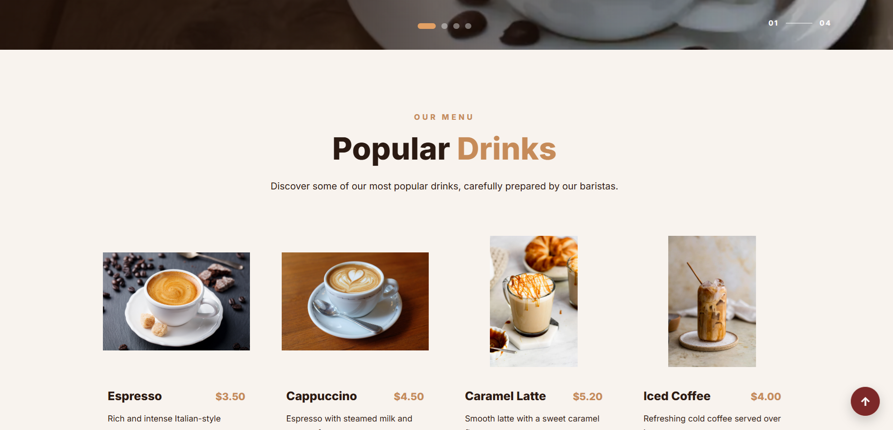
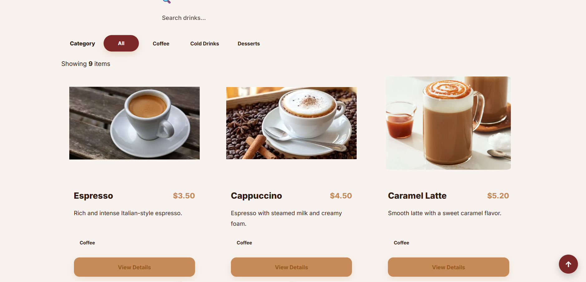
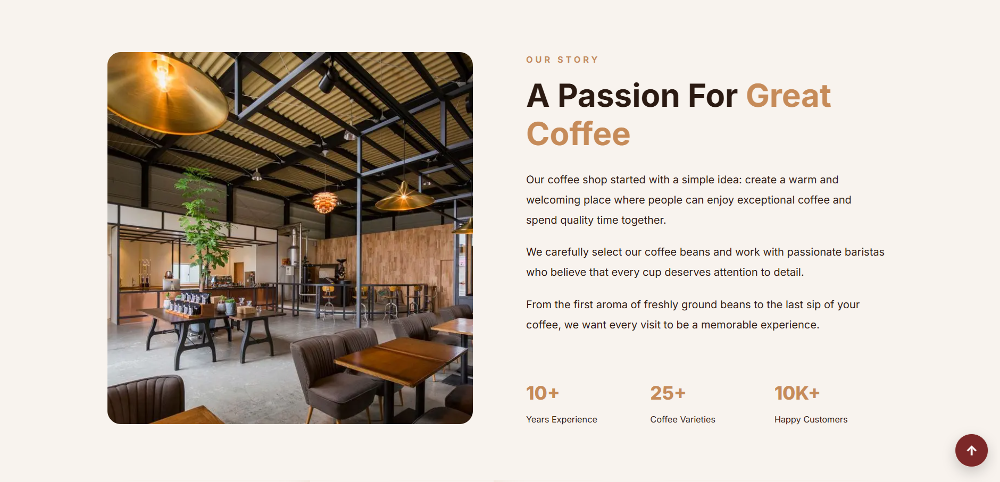
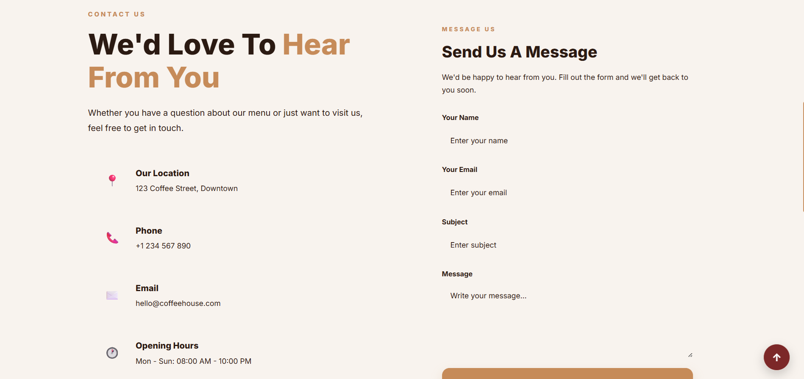
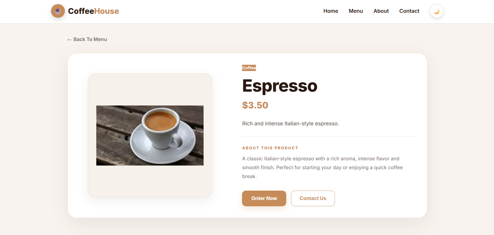
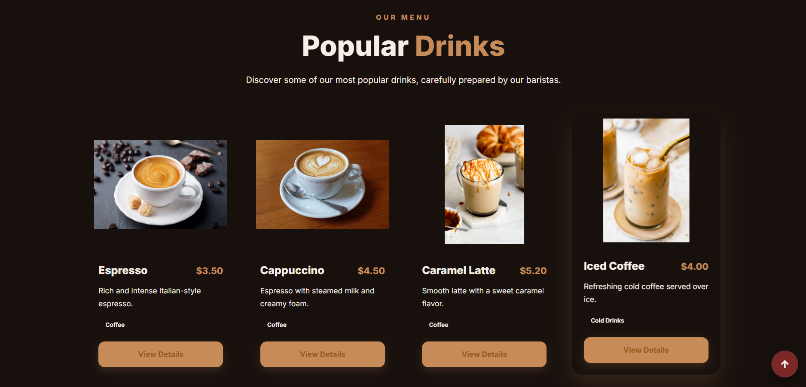

# ☕ Coffee House

<p align="center">
  <strong>A modern, responsive and elegant coffee shop website built with Next.js, React, Sass and HeroUI.</strong>
</p>

<p align="center">
  <a href="https://coffee-house-next-js-sass-hero-ui.vercel.app/">
    🚀 Live Demo
  </a>
  &nbsp;&nbsp;•&nbsp;&nbsp;
  <a href="https://github.com/mohammadjmweb/Coffee-house-next-js-sass-hero-ui">
    💻 GitHub Repository
  </a>
</p>

<p align="center">


</p>

---

## 🌐 Live Demo

Experience the live version of **Coffee House**:

<p align="center">

<a href="https://coffee-house-next-js-sass-hero-ui.vercel.app/">
    🚀 Live Demo
  </a>

</p>

The application is deployed on **Vercel** and built with the Next.js framework.

---

## 💻 GitHub Repository

<p align="center">

### 🔗 [View Source Code on GitHub](https://github.com/mohammadjmweb/Coffee-house-next-js-sass-hero-ui)

</p>

---

# 📖 About The Project

**Coffee House** is a modern coffee shop website created with **Next.js and React**.

The project was designed with a focus on:

* Modern UI/UX
* Responsive design
* Reusable React components
* Modular Sass architecture
* Dark and light themes
* Product detail pages
* Clean navigation
* Optimized page structure
* Smooth user experience

The website provides visitors with a complete coffee shop experience, including a home page, menu, product details, about page and contact page.

---

# ✨ Features

* ☕ Modern coffee shop UI
* 🏠 Responsive Home page
* 📋 Menu page
* ☕ Product cards
* 🔎 Product Details page
* ℹ️ About page
* 📍 Contact page
* 🌙 Dark Mode
* ☀️ Light Mode
* 🌓 Theme switching
* 📱 Fully responsive design
* 🧩 Reusable React components
* 🎨 Modular Sass styling
* 🖼️ Next.js Image optimization
* ⬆️ Scroll To Top functionality
* ⏳ Loading screen
* 🧭 Client-side navigation
* ⚡ Next.js App Router
* 🚀 Vercel deployment

---

# 🛠️ Technologies Used

## Frontend

| Technology           | Purpose                                      |
| -------------------- | -------------------------------------------- |
| **Next.js 16.3.1**   | React framework and application architecture |
| **React 19.2.8**     | Building interactive UI components           |
| **JavaScript / JSX** | Application logic and component development  |

## Styling

| Technology                 | Purpose                            |
| -------------------------- | ---------------------------------- |
| **Sass**                   | Advanced and modular styling       |
| **SCSS Modules**           | Component-scoped styles            |
| **Tailwind CSS / PostCSS** | CSS processing and utility support |

## UI & Icons

| Technology    | Purpose              |
| ------------- | -------------------- |
| **HeroUI**    | Modern UI components |
| **Heroicons** | Interface icons      |

## State & Theme

| Technology      | Purpose                       |
| --------------- | ----------------------------- |
| **next-themes** | Dark / Light theme management |

## HTTP & Data

| Technology | Purpose                             |
| ---------- | ----------------------------------- |
| **Axios**  | HTTP requests and API communication |

## Development Tools

| Technology         | Purpose                  |
| ------------------ | ------------------------ |
| **ESLint**         | Code quality and linting |
| **React Compiler** | React optimization       |
| **Vercel**         | Production deployment    |
| **Git / GitHub**   | Version control          |

---

# 📸 Screenshots

## 🏠 Home

<p align="center">
  
</p>

---

## ☕ Menu

<p align="center">
  
</p>

---

## ℹ️ About

<p align="center">
  
</p>

---

## 📍 Contact

<p align="center">
  
</p>

---

## ☕ Product Details

<p align="center">
  
</p>

---

## 🌙 Dark Mode

<p align="center">
  
</p>

---

# 📂 Project Structure

```text
Coffee-house-next-js-sass-hero-ui/
│
├── app/
│   │
│   ├── about/
│   │   └── page.jsx
│   │
│   ├── contact/
│   │   └── page.jsx
│   │
│   ├── menu/
│   │   └── page.jsx
│   │
│   ├── favicon.ico
│   │
│   ├── globals.scss
│   │
│   ├── layout.jsx
│   │
│   ├── loading.jsx
│   │
│   ├── loading.module.scss
│   │
│   ├── page.jsx
│   │
│   ├── page.module.css
│   │
│   ├── page.module.scss
│   │
│   └── providers.jsx
│
├── components/
│   │
│   ├── Footer.jsx
│   ├── Hero.jsx
│   ├── MenuSection.jsx
│   ├── Navbar.jsx
│   ├── ProductCard.jsx
│   ├── ScrollToTop.jsx
│   └── ThemeToggle.jsx
│
├── public/
│   │
│   ├── assets/
│   │
│   ├── file.svg
│   ├── globe.svg
│   ├── next.svg
│   ├── vercel.svg
│   └── window.svg
│
├── screenshots/
│   │
│   ├── home.png
│   ├── menu.png
│   ├── about.png
│   ├── contact.png
│   ├── product-details.png
│   └── dark-mode.png
│
├── styles/
│   │
│   ├── about.module.scss
│   ├── cards.module.scss
│   ├── contact.module.scss
│   ├── footer.module.scss
│   ├── hero.module.scss
│   ├── menu.module.scss
│   ├── navbar.module.scss
│   ├── productDetails.module.scss
│   └── scrollToTop.module.scss
│
├── .gitignore
├── eslint.config.mjs
├── jsconfig.json
├── next.config.mjs
├── package.json
├── package-lock.json
├── postcss.config.mjs
└── README.md
```

The structure above reflects the current repository organization, including the actual application routes, reusable components, Sass modules and configuration files.

---

# 📄 Application Pages

### 🏠 Home

The main landing page containing the hero section, popular drinks, coffee highlights and call-to-action sections.

### ☕ Menu

A dedicated menu page displaying available coffee and drinks.

### 🔎 Product Details

A detailed view for individual coffee products, allowing users to explore a selected product.

### ℹ️ About

Information about Coffee House and its story.

### 📍 Contact

Contact information, location and communication details.

---

# 🌙 Theme System

Coffee House supports both:

* ☀️ Light Mode
* 🌙 Dark Mode

Theme switching is handled using **next-themes**, allowing the interface to dynamically adapt between light and dark appearances.

---

# 📱 Responsive Design

The website is designed to provide a consistent experience across:

* 🖥️ Desktop
* 💻 Laptop
* 📱 Mobile
* 📲 Tablet

The layouts and components adapt to different screen sizes using responsive SCSS styling.

---

# 🧩 Reusable Components

The project uses a component-based architecture.

Important reusable components include:

```text
Navbar
Hero
MenuSection
ProductCard
ThemeToggle
ScrollToTop
Footer
```

This approach makes the application easier to maintain, reuse and extend.

---

# 🎨 Styling Architecture

The project uses **Sass/SCSS Modules** to keep styles organized and component-specific.

```text
styles/
├── about.module.scss
├── cards.module.scss
├── contact.module.scss
├── footer.module.scss
├── hero.module.scss
├── menu.module.scss
├── navbar.module.scss
├── productDetails.module.scss
└── scrollToTop.module.scss
```

This structure helps prevent global CSS conflicts and keeps each section of the application maintainable.

---

# ⚡ Getting Started

## 1. Clone the repository

```bash
git clone https://github.com/mohammadjmweb/Coffee-house-next-js-sass-hero-ui.git
```

## 2. Navigate into the project

```bash
cd Coffee-house-next-js-sass-hero-ui
```

## 3. Install dependencies

```bash
npm install
```

## 4. Run the development server

```bash
npm run dev
```

## 5. Open the application

```text
http://localhost:3000
```

---

# 🏗️ Production Build

Create an optimized production build:

```bash
npm run build
```

Start the production server:

```bash
npm start
```

The available npm scripts are defined in the project's `package.json`.

---

# ☁️ Deployment

The project is deployed using **Vercel**.

### Production

🚀 https://coffee-house-next-js-sass-hero-ui.vercel.app/

---

# 🔮 Future Improvements

Possible future improvements include:

* 🛒 Shopping cart
* 💳 Online payment
* 👤 User authentication
* 🔎 Menu search
* 🏷️ Product filtering
* ⭐ Customer reviews
* 📦 Order management
* 📧 Newsletter system
* 🗺️ Interactive map
* 🌐 Multi-language support
* 📊 Admin dashboard

---

# 👨‍💻 Author

## Mohammad Jm

Frontend Developer

Built with ☕, React and Next.js.

---

# ⭐ Support

If you like this project, consider giving the repository a ⭐ on GitHub.

<p align="center">
  <a href="https://github.com/mohammadjmweb/Coffee-house-next-js-sass-hero-ui">
    ⭐ Star this Repository
  </a>
</p>

---

<p align="center">
  Made with ☕ & ❤️
</p>

<p align="center">
  <strong>Coffee House — Every Cup Has Its Own Story.</strong>
</p>
